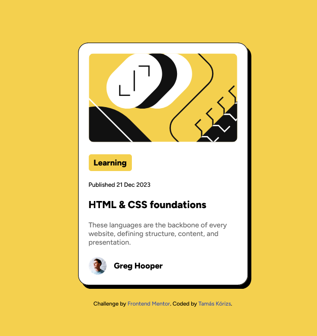

# Frontend Mentor - Blog preview card solution

This is a solution to the [Blog preview card challenge on Frontend Mentor](https://www.frontendmentor.io/challenges/blog-preview-card-ckPaj01IcS). Frontend Mentor challenges help you improve your coding skills by building realistic projects.

## Table of contents

- [Overview](#overview)
  - [The challenge](#the-challenge)
  - [Screenshot](#screenshot)
  - [Links](#links)
- [My process](#my-process)
  - [Built with](#built-with)
  - [What I learned](#what-i-learned)
  - [Useful resources](#useful-resources)
- [Author](#author)

## Overview

### The challenge

Users should be able to:

- See hover and focus states for all interactive elements on the page

### Screenshot



### Links

- Solution URL: [Blog Preview Card](https://blogpreviewcard-mocha.vercel.app/ "Blog Preview Card")

## My process

### Built with

- Semantic HTML5 markup
- CSS custom properties
- Flexbox
- CSS Grid
- Mobile-first workflow

### What I learned

In this project I had to use CSS Flexbox to position the elements inside the wrapper

```html
<div class="wrapper"></div>
```

```css
.wrapper {
  display: flex;
  justify-content: center;
  align-items: center;
  flex-direction: column;
}
```

### Useful resources

- [CSS Flexbox Layout Guide](https://css-tricks.com/snippets/css/a-guide-to-flexbox/ "CSS Flexbox Layout Guide") - The comprehensive guide to CSS flexbox layout. This complete guide explains everything about flexbox.
- [W3Schools](https://www.w3schools.com/ "W3Schools") - If you want to learn code ;)

## Author

- Frontend Mentor - [@korizst](https://www.frontendmentor.io/profile/korizst "Tamás Kórizs")
